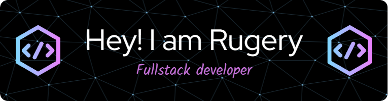

Acerca de mí

Soy un apasionado de la tecnología y un entusiasta del código abierto. Me encanta explorar nuevas tecnologías y contribuir a proyectos que hacen del mundo un lugar mejor.

 
 #   Tecnologías 

